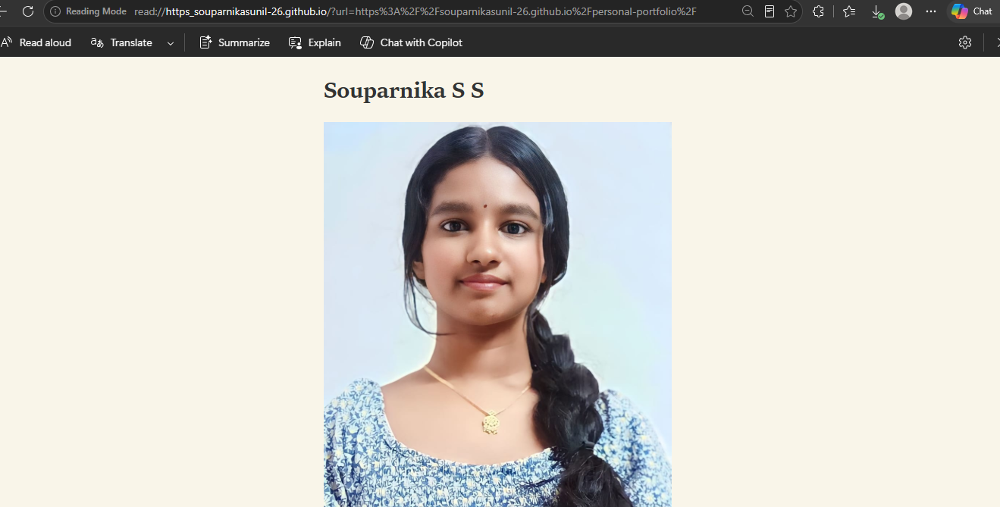
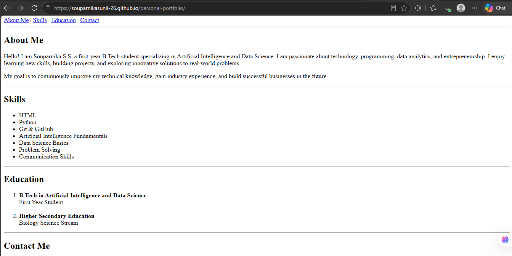
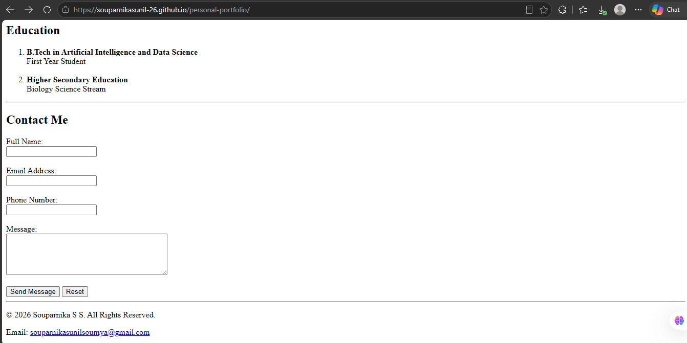

# Personal Portfolio Page

## Description

This project is a Personal Portfolio Page created using HTML5. The portfolio showcases my profile, skills, education, and contact information. The purpose of this project is to demonstrate HTML fundamentals, semantic page structure, forms, images, links, and lists.

## Features

* Name and Profile Picture
* About Me Section
* Skills Section
* Education Section
* Contact Form
* Semantic HTML Structure

## Technologies Used

* HTML5

## Screenshots

### Home Section

### About Me and Skills

### Education and Contact Form

## Author

Souparnika S S

B.Tech Artificial Intelligence and Data Science (1st Year)
